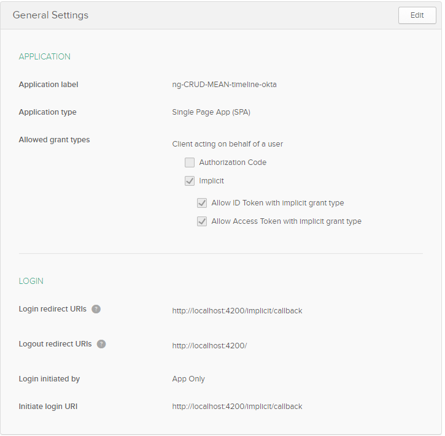

Tutorial: https://dzone.com/articles/tutorial-connect-your-angular-app-to-mysql

ToDo: install exactly the version used in the tutorial

Problem: Property 'initAuth' does not exist on type 'typeof OktaAuthModule'.
Fix and Solution of the problem: Use Okta 2 instead of version 1 and use newer examples like: https://github.com/okta/samples-js-angular/tree/master/custom-login

## Prerequisition

- A already installed MySQL or MariaDB database server.
- nodejs and npm.

## Create database

Login into database:
`$ mysql -h localhost -u root -p`

~~~
create database hscheel_timeline;
use hscheel_timeline;

// create a user and grant all rights to the currently created database
create user 'hscheel_timeline_user'@'localhost' identified by 'hscheel_timeline_user_password';
grant all on hscheel_timeline.* to 'hscheel_timeline_user'@'localhost';

// create the table
create table events (
  id INT AUTO_INCREMENT,
  owner VARCHAR(255) NOT NULL,
  name VARCHAR(255) NOT NULL,
  description TEXT,
  date DATE,
  PRIMARY KEY (id),
  INDEX (owner, date)
);

quit
~~~

## Set up a Simple CRUD Node Express Server

`npm init`

`npm install --save-exact express@4.17.1 cors@2.8.5 mysql@2.17.1`

or

`npm install --save-exact express cors mysql`

Fix for error: "Error: ER_NOT_SUPPORTED_AUTH_MODE: Client does not support authentication protocol":
~~~
ALTER USER 'hscheel_timeline_user'@'localhost' IDENTIFIED WITH mysql_native_password BY 'hscheel_timeline_user_password';
~~~

Start nodejs server: `node timline-server\src\index.js`

`npm install --save-exact express-bearer-token@2.4.0 @okta/jwt-verifier@1.0.0`

## Okta settings
https://developer.okta.com/

## The Timeline Angular Client
`ng add ngx-bootstrap@5.1.0`

`npm install --save-exact ngx-timeline@5.0.0 @okta/okta-angular@1.2.1`

## Further Infos
https://developer.okta.com/blog/2019/05/13/angular-8-spring-boot-2

